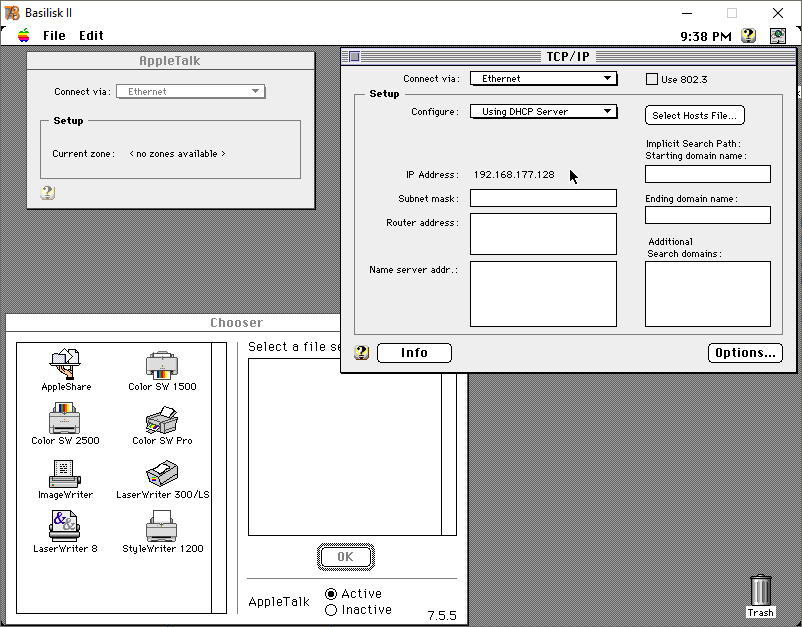

# Mac OS 7.6.1 (68k) Setup with Basilisk II and TAP Interface Networking

## Overview

Mac OS 7.6.1, released in 1997, was a significant update for 68k-based Macintosh computers. Although it wasn’t the last OS version to support 68k Macs, it marked Apple’s shift to the "Mac OS" branding and introduced several system improvements, particularly in stability and networking.

### Key Changes from Mac OS 7.5/7.6

- **Open Transport** replaces **MacTCP**, supporting modern networking protocols like DHCP.
- Enhanced compatibility with newer peripherals and devices, especially through **Open Transport**.
- Updated system utilities to improve functionality on 68k systems.

This guide will walk you through setting up **Mac OS 7.6.1** on **Basilisk II**, configuring networking using **TAP interfaces**, and customizing installation components for optimized performance on the 68k architecture.

## Installation Steps

### 1. Basilisk II Configuration and ROM Selection

For best Ethernet support in Basilisk II, I recommend the following ROM:

**`1993-02 - F1ACAD13 - Quadra, Centris 610,650,800.ROM`**

This ROM supports **AppleTalk** seamlessly. Other ROMs, like the **`1991-10 - 420DBFF3 - Quadra 700&900 & PB140&170.ROM`**, enable TCP/IP but may encounter errors with AppleTalk, especially on **Ethernet**. 

#### Basilisk II Setup

1. **Download and Install Basilisk II**.
2. **ROM Selection**:
   - Use the **Quadra/Centris ROM** mentioned above.
3. **Basilisk II Preferences**:
   - **Volumes**:
      - Add the **7.6.1 CD-ROM ISO** as bootable.
      - Create and format a virtual hard disk during installation.
   - **Graphics**:
      - Set **Screen Resolution** to **800x600** at **60Hz**.
      - Choose **32-bit color depth**.
   - **Sound**:
      - Enable sound for basic audio support.
   - **Networking**:
      - Set **Ethernet** to the **TAP interface** you configure for networking.
   - **Memory/Misc**:
      - Allocate **16 MB** or more for optimal performance.
      - Set **Mac Model ID** to **Quadra 900** and **CPU Type** to **68040**.
      - Select the **Quadra ROM** file.
4. **JIT Compiler**:
   - Enable **JIT (Just-In-Time) Compilation** for faster processing if supported.

### 2. Installing Mac OS 7.6.1

After booting from the ISO, follow these steps:

1. **Initialize** the virtual disk.
2. **Run the Install Mac OS** program.
3. Choose **Option 4** to **Install the Software**.
4. Select the virtual disk you initialized, then click **Install Now**.
5. **Customize the Installation** (click "Customize") to access **Easy Install** and **Custom Install** options.

#### Recommended Customization

- **Easy Install** is recommended, as micromanaging options often leaves unnecessary or incompatible components.
   - **Uncheck** PowerPC-specific options, such as **OpenDoc** and **QuickDraw 3D**.
   - Optionally, uncheck **MacLink Plus** if not needed.
   - For AppleTalk and TCP/IP, ensure **Open Transport** is installed.

6. **Start Installation**.
   - After completing the installation, **shut down** instead of rebooting to avoid crashes.
7. **Boot into Mac OS 7.6.1**:
   - Go to the **Apple Icon** -> **Control Panels** -> **Monitor**.
   - Set **Colors** from **Greys** to **Millions** for full color support.

### 3. Custom Install Options Overview

Below is a list of key **Custom Install** options, detailing the components, platforms they support, and their relevance for 68k:

| Component           | Platform Compatibility | Description |
|---------------------|------------------------|-------------|
| **Open Transport**  | 68k & PowerPC          | Provides advanced networking with support for TCP/IP and AppleTalk. Essential for 68k networking. |
| **OpenDoc**         | PowerPC Only           | A document management component. Not required for 68k; deselect this to save resources. |
| **QuickDraw 3D**    | PowerPC Only           | Provides 3D graphics support. Deselect for 68k, as it’s incompatible. |
| **MacLink Plus**    | 68k & PowerPC          | Document conversion utility. Optional; useful if transferring documents from non-Mac formats. |
| **Printer Drivers** | 68k & PowerPC          | Install only if you plan to use a printer in the emulated environment. |
| **PC Exchange**     | 68k & PowerPC          | Adds support for DOS/Windows disks, allowing read/write access. Useful if transferring files from DOS-based systems. |

### 4. Networking Configuration

After installation, configure network settings:

- **AppleTalk**:
   - Open **AppleTalk** control panel.
   - Select **Ethernet** as the connection method.
  
- **TCP/IP**:
   - Open **TCP/IP** control panel.
   - Select **Open Transport**.
   - Choose **Using DHCP Server** if your network supports DHCP.
   - Alternatively, manually enter IP configuration if DHCP isn’t available.

### 5. Testing Network Connectivity

Mac OS 7.6.1 lacks built-in tools like `ping`, so you may want to install third-party network utilities (e.g., **MacTCP Watcher**). You can also verify AppleTalk by accessing available network shares.

## Final Notes

This guide assumes familiarity with **TAP interfaces** and basic network setup. With this setup, your virtual Mac OS 7.6.1 will support AppleTalk and TCP/IP, enabling it to connect to your local network through **Basilisk II**.