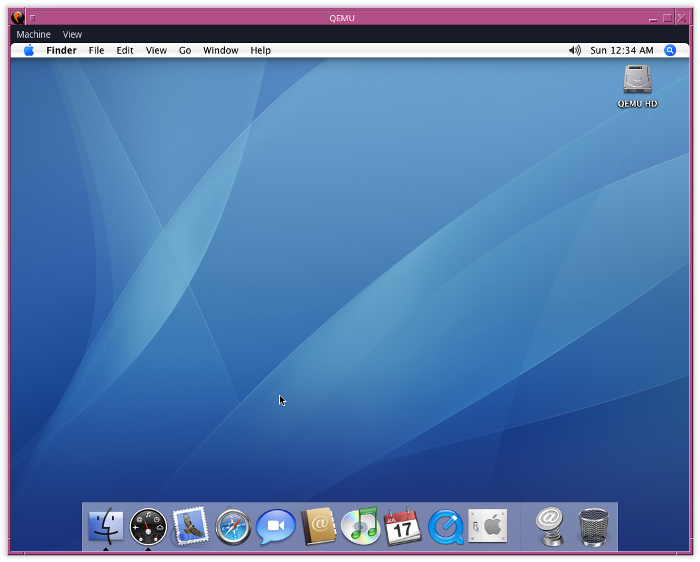

# Mac OS X 10.4 (QEMU/PowerPC)



### 1. Personal History

Mac OS X 10.4 is one half of a duo that comprises a legendary period for Mac OS X. You could compare this period to the Sgt. Pepper/The White Album era in the Beatles' career. Mac OS X had gone from building its own platform to solidifying it. It was now bolstered by a solid, high-performance operating system combined with a killer first-party software lineup in the form of Safari, Mail, DVD Player, iPhoto, and, for myself, Pages via iWork.

So not only are my front-facing applications allowing me to consume and create media in a genuinely transformative way through Apple’s iLife applications, but then add in the UNIX layer derived from BSD, forming the Darwin foundation beneath it, which had also matured quite a bit. I found myself in one of those rare moments in computing - a perfect OS on perfect hardware - my PowerBook 17.

---

### 2. Version History - Mac OS X 10.4 Tiger

## 10.4.0

**Released:** April 29, 2005  
Initial public release. PowerPC only.

Major changes introduced with Tiger:

- Spotlight system-wide metadata indexing
- Smart Folders in Finder
- Dashboard widget environment
- Automator workflow builder
- Core Image (GPU-accelerated image processing)
- Core Video
- launchd replacing init, cron, and xinetd
- 64-bit userland support on PowerPC G5
- QuickTime 7 with H.264 support
- Safari 2.0 with RSS integration
- Mail 2.0 with Smart Mailboxes
- Updated Xcode 2.0 toolchain

---

## 10.4.1

**Released:** May 16, 2005

Primarily stabilization:

- Spotlight indexing reliability fixes
- Mail stability improvements
- Safari crash fixes
- Dashboard performance adjustments
- Graphics driver corrections

---

## 10.4.2

**Released:** July 12, 2005

Focused refinement release:

- Improved GPU driver stability (ATI and NVIDIA)
- Networking reliability updates (AFP/SMB improvements)
- Bluetooth stack fixes
- Improved file sharing reliability
- Airport driver updates

---

## 10.4.3

**Released:** October 31, 2005

Significant maturation point:

- Major memory management optimizations
- Spotlight performance tuning
- Faster Finder responsiveness
- Core Image refinements
- Expanded hardware compatibility
- Extensive bug fixes across system frameworks

---

## 10.4.4

**Released:** January 10, 2006  
First release supporting Intel-based Macs.

- Rosetta translation layer introduced
- Universal binary support implemented
- Kernel adjustments for dual-architecture support
- Updated drivers for early Intel hardware

---

## 10.4.5

**Released:** February 14, 2006

Intel-era refinement:

- Improved Rosetta performance
- Core Image improvements on Intel GPUs
- Graphics driver updates
- Stability improvements across Cocoa frameworks

---

## 10.4.6

**Released:** April 3, 2006

Hardware and communication updates:

- iChat AV improvements
- Audio driver updates
- Graphics stack refinements
- Networking and VPN reliability improvements

---

## 10.4.7

**Released:** June 29, 2006

Security and networking update:

- Airport driver improvements
- Security patches
- SMB and AFP refinements
- Improved performance under heavy I/O

---

## 10.4.8

**Released:** September 29, 2006

Support expansion release:

- Support for newer Mac Pro hardware
- Graphics driver improvements
- File system reliability improvements
- Security updates

---

## 10.4.9

**Released:** March 13, 2007

Large maintenance release:

- Major security patches
- Driver updates
- Spotlight indexing stability improvements
- Improved performance on Intel Macs
- File system journaling refinements

---

## 10.4.10

**Released:** June 20, 2007

Incremental stability update:

- Airport reliability updates
- Graphics driver fixes
- Additional security updates
- Application compatibility improvements

---

## 10.4.11

**Released:** November 14, 2007  
Final Tiger release.

- Final security patches
- Compatibility adjustments for later hardware
- Stability refinements
- End-of-life build

---

### 3. Installation

This assumes that qemu-system-ppc is installed.

First, let’s create the qcow2 image file that serves as our virtual hard disk.

```bash
qemu-img -f qcow2 MacOSX104.qcow2 10G
```

10GB feels about right for the time period, and the actual amount of data I would have on this disk. Most of my storage needs will come from a network share of some type (SMB/AFP).

Like my other QEMU based installations, I continue to employ batch files or shell scripts to start up the VM, which for Mac OS X 10.4 look like this:

#### Batch File Version

**start-cd.bat**

```batch
"C:\Program Files\qemu\qemu-system-ppc.exe" ^
     -L pc-bios -M mac99,via=pmu -m 2048M ^
     -boot d ^
     -hda MacOSX104.qcow2 ^
     -cdrom "MacOSX104.iso"
REM     -netdev tap,ifname=TAP0,id=network0 -device sungem,netdev=network0
```

#### Shell Version

**start-cd.sh**

```bash
qemu-system-ppc \
-L pc-bios -M mac99,via=pmu -m 2048M \
-display gtk \
-boot d \
-hda MacOSX104.qcow2 \
-cdrom "MacOSX104.iso"
#-netdev tap,ifname=tap0,id=network0 -device sungem,netdev=network0
```

In both cases I omit the network adapter and enable or uncomment it post-installation, or if I want networking available while installing from the CD.

Running `start-cd.bat`, the installer begins with the language selection screen in all its Aqua glory. English for me, then click the translucent arrow button on the bottom right of the screen.

This brings us to the Installer proper, which I am going to bypass for the time being and click **Utilities → Disk Utility** in the menu bar.

Clicking on my **10.0GB QEMU HARDDISK**, followed by **Erase**, which resides in the menu bar at the center of the screen, I will use the following settings:

**Volume Format:** Mac OS Extended (Journaled)

Journaled file systems were all the rage around this time, as operating systems began moving away from older filesystem designs toward journaling for better crash recovery and reliability, with nearly every platform adopting it as the next major step in filesystem design.

**Name:** QEMU HD

I will also uncheck **Install Mac OS 9 Disk Driver**. It is not needed, particularly because this is a VM running standalone Mac OS X 10.4. Finally, click **Erase**.

Quitting Disk Utility takes us back to the Installer, where we can click **Continue** twice, followed by the inevitable licensing agreement.

From there, the **QEMU HD** disk is ready to go in the **Select a Destination** screen, and we can click **Continue**.

This brings us to my favorite part of the old Mac OS X installation screens, the ability to customize what is going to be installed or not installed - which at the moment defaults to **Easy Install** - a carryover term from the old System Software days.

I will click **Customize**.

First what to uncheck...

For myself, that would be **Printer Drivers**. I have only had one purpose to use a printer since 1996, and that is for printing out resumes/CVs.

I will also uncheck **Language Translations**, as I have no use for them, thereby saving 1.1GB of storage space.

Lastly, my favorite part, placing a check for **X11** to be installed.

I really do love this part because it reminds me that I am running an operating system built on UNIX, and what Mac OS X represented to me at the time - the perfect synergy between CLI and GUI.

Lastly, clicking **Install** will kick things off and all we have to do is kick back and enjoy the **Aqua** colored progress bar, which in my case lasted for about 5 minutes.

Once installation is complete, a restart will ensue, where we will terminate QEMU and move on to the setup phase.

---

### 4. Post Installation Setup

Now it's time to boot up using the HDD variants of my scripts, depending on which platform I am running on.

#### Batch File Version

**start-hdd.bat**

```batch
"C:\Program Files\qemu\qemu-system-ppc.exe" ^
     -L pc-bios -M mac99,via=pmu -m 2048M ^
     -boot c ^
     -hda MacOSX104.qcow2 ^
     -cdrom "MacOSX104.iso"
REM     -netdev tap,ifname=TAP0,id=network0 -device sungem,netdev=network0
```

#### Shell Version

**start-hdd.sh**

```bash
qemu-system-ppc \
-L pc-bios -M mac99,via=pmu -m 2048M \
-display gtk \
-boot c \
-hda MacOSX104.qcow2 \
-cdrom "MacOSX104.iso"
#-netdev tap,ifname=tap0,id=network0 -device sungem,netdev=network0
```

**Note:** The boot-up sequence will take longer than usual. This is an old issue that I noticed particularly in Mac OS X 10.4, and perhaps Mac OS X 10.5. This will go away once we set the **Start Up Disk**. For the moment, be patient, and the *Before You Begin...* screen will appear, requesting we identify what kind of keyboard is in use.

Clicking **OK** on the screen brings up the actual identification part, which, in my case using an ANSI keyboard, means pressing **Z** and **/**, followed by a confirmation that I am indeed using an ANSI keyboard, and a quick click of the **Continue** button.

This will be followed by the **Welcome** screen, where we select which country we are in. I will leave it at **United States**, and click **Continue**.

Up next, it's nice to take a moment to appreciate the **"Already Own a Mac?"** screen - something that is still around to this day. This is just something that other OSes never got quite right, that Mac OS X made look easy, but for the moment the indicator will remain at **"Do not Transfer my information"**.

Continuing by clicking **Continue**, we can quickly skate on by the keyboard selection screen.

Sadly, I will not be entering in my Apple ID at the **Enter Your Apple ID** screen, but once again the seamlessness is quite apparent, but we'll wave out the window as we pass by, by clicking **Continue**.

Up next is really the only Registration Information screen I ever took seriously, or felt the impulse to take it seriously. I probably did somewhere between 30-60 installations when this release was still the latest and greatest, and many more after, filling it out each time. It felt like it mattered, or to be more specific, it felt like I was part of this community where things like this should be given my full attention. Mac OS X 10.4 was just that good of a release.

Oh, and Apple made it feel like it was mandatory by not letting you just click **Continue**. So yeah, there’s that.

This time though, we’ll also wave ourselves by with **Command+Q** officially, and **Windows+Q** for us emulated folk on a Windows keyboard layout followed by clicking **Skip**.

Next, we get to create our user account that will act as our avatar in the BSD and Aqua layers of Mac OS X 10.4.

Lastly, we get to set our Time Zone, date/time, and finalize it all by clicking **Done**.

Once in your desktop environment, I would recommend opening **System Preferences**, then **Start Up Disk** - selecting your virtual volume.

This should speed things up from boot to loading the operating system off the virtual disk, as without a defined startup disk, Open Firmware will spend time scanning for a bootable volume. On a real Mac this value would often already be set, but not always, and it was enough of a nuisance when it wasn’t. In QEMU it is typically not set at all, resulting in a noticeable delay at boot. Setting the disk in **Start Up Disk** writes this information and allows the system to boot directly.

---

### 5. Software Updates

As of the time of this writing, software updates are still available from Apple because Mac OS X 10.4 uses a newer Software Update framework and network stack that supports modern HTTPS connections, including TLS versions still accepted by Apple’s servers, whereas earlier versions such as 10.0 through 10.3 rely on outdated SSL/TLS implementations and Software Update mechanisms that can no longer establish a secure connection, simply by using the **Software Update** application.

Equally, this likely kicked off automatically, as QEMU uses its default SLIRP network functionality to provide basic outbound NAT network access, which, in most cases in 2026, includes Internet access.
