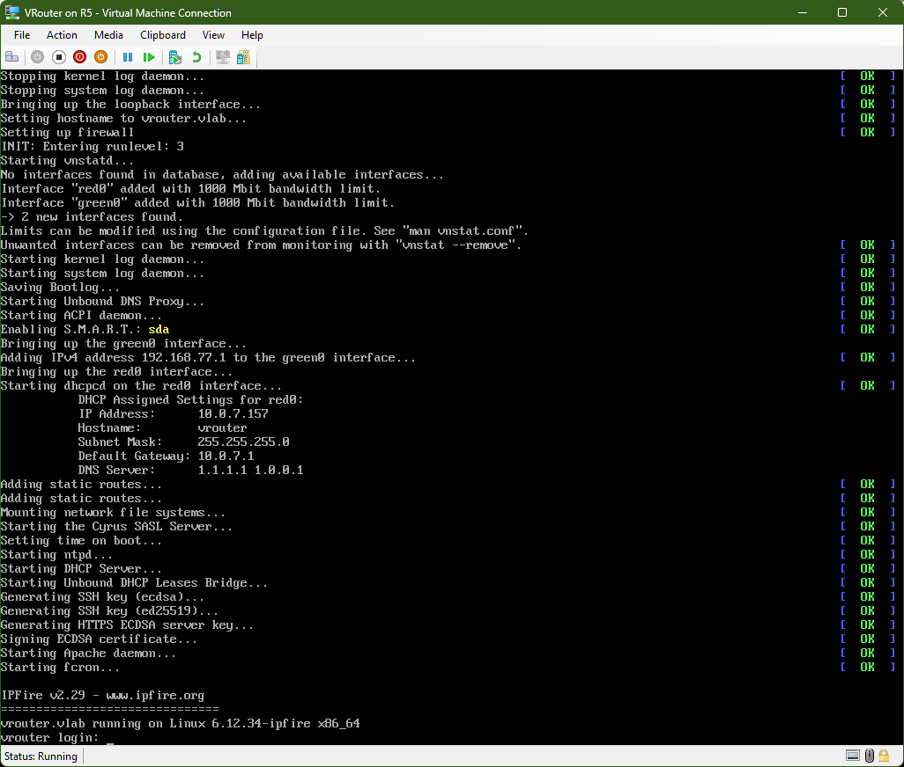

# Hyper-V: External Switch to Internal Switch Router



> "Control, control! You must learn control!" - Yoda

## 1.  Personal History

Virtual Routers and I go back to around 2002/2003 when I was going through a phase of "I can bridge or route anything, over anything". This involved a lot of unconventional projects, and frankly, the more unconventional it was, the more I was interested in completing it. This included such projects as:

- **Bandwidth Limiter:** At my co-location facility, bandwidth bills could skyrocket with just a few missteps. To keep costs predictable, I built a FreeBSD bridge that throttled traffic at the edge. It ran on an old, forgotten work computer I had repurposed into a 1U rackmount case, cheap, reliable, and would have made the Hewlett brothers proud. That system kept my monthly invoices firmly under control.

- **Neighborhood HotSpot:** I wanted to give free WiFi to anyone within range as a public service. A small but fashionable omni-directional antenna in my kitchen window extended the signal throughout the area. Behind it sat a D-Link access point patched into a Sony ultrabook running NetBSD. It acted as a bridge to a PCMCIA WiFi adapter, which linked to a WiFi card inside my bedroom server bound to an OpenBSD VM router. From there, traffic was filtered, bandwidth shaped, isolated from my LAN, and pushed out through a PCI ethernet card to the internet.

- **IPv6 Gateway:** My ISP offered no inbound IPv6 controls at the time, which made personal IPv6 related projects nearly impossible. To work around that, I rented a VPS with a /64 and built a TAP-based IPv4 OpenVPN tunnel to a Debian VM at home. The VPS held ::1, and I assigned ::2 to the Debian side. The tunnel’s TAP interface on Debian was bridged to a physical NIC, which I gave ::3. That address was still part of the VPS-delegated /64, but it served as the entry point into a separate subnet managed by pfSense. The NIC was pfSense’s external interface, and from there pfSense handled routing for the downstream IPv6 network. Traffic followed a clear path - ::1 to ::2 to ::3 - with pfSense in charge of everything behind it. It was more of a journey than a destination project, but it gave me valuable insights into what can and cannot be done within IPv6 in IPv4 tunnels.

...and so on over the decades. This Hyper-V virtual network project is really more of a stop on the side of the road while I build a virtual ecosystem behind the internal interface of this soon to be router, and could be considered a sibling of the IPv6 Gateway project, just much more simplified. No crazy subnet forwarding through OpenVPN tunnels this time. Just an external Hyper-V network switch, an internal Hyper-V switch, and IPFire as the guest operating system. Easy Peasy.

## 2. Virtual Networking Setup

One of the reasons I enjoy networking in Hyper-V is that internal networks operate at 10 Gbps, compared to 1 Gbps in VMware Workstation. In PowerShell (my preferred method), let's create an external and an internal Hyper-V switch.

```powershell
# Run in an elevated PowerShell session.

Get-NetAdapter

Name                      InterfaceDescription                         ifIndex Status       MacAddress             LinkSpeed
----                      --------------------                         ------- ------       ----------             ---------
vEthernet (iEthernet)     Hyper-V Virtual Ethernet Adapter #3               35 Up           00-15-5D-07-32-04        10 Gbps
OpenVPN TAP-Windows6 #1   TAP-Windows Adapter V9 #2                         32 Disconnected 00-FF-E9-2A-FA-CC         1 Gbps
Ethernet 5                VirtualBox Host-Only Ethernet Adapter             29 Up           0A-00-27-00-00-1D         1 Gbps
VMware Network Adapte...1 VMware Virtual Ethernet Adapter for ...           26 Up           00-50-56-C0-00-01       100 Mbps
OpenVPN TAP-Windows6      TAP-Windows Adapter V9                            19 Disconnected 00-FF-90-29-EB-D6         1 Gbps
Bluetooth Network Conn... Bluetooth Device (Personal Area Netw...           17 Disconnected CC-28-AA-6B-1B-34         3 Mbps
Ethernet 4                Realtek Gaming GbE Family Controller              13 Up           18-C0-4D-EE-62-62         1 Gbps
vEthernet (Default Swi... Hyper-V Virtual Ethernet Adapter                  37 Up           00-15-5D-6C-7C-99        10 Gbps
Tailscale                 Tailscale Tunnel                                  14 Up                                   100 Gbps
OpenVPN Data Channel O... OpenVPN Data Channel Offload                       3 Disconnected                           1 Gbps
VMware Network Adapte...8 VMware Virtual Ethernet Adapter for ...            2 Up           00-50-56-C0-00-08       100 Mbps

New-VMSwitch -Name iEthernet -SwitchType Internal

Name       SwitchType NetAdapterInterfaceDescription
----       ---------- ------------------------------
iEthernet  Internal

New-VMSwitch -Name eEthernet -NetAdapterName "Ethernet 4" -AllowManagementOS $true

Name       SwitchType NetAdapterInterfaceDescription
----       ---------- ------------------------------
eEthernet  External   Realtek Gaming GbE Family Controller

Get-VMSwitch

Name            SwitchType NetAdapterInterfaceDescription
----            ---------- ------------------------------
Default Switch  Internal
iEthernet       Internal
eEthernet       External   Realtek Gaming GbE Family Controller
```

Note: `-AllowManagementOS $true` ensures the host OS can continue using the NIC while it is shared with the external switch.

## 3. IPFire Setup

IPFire is one of my favorite appliance routers, it gets straight to the point - if all you want to do is route network traffic. For this project I don't really need a pfSense or OPNsense (as much as I love BSD), and while I could strip away even more overhead by just running Debian bound to the virtual External/Internal interfaces, with `net.ipv4.forwarding=1` and an `iptables` NAT rule - IPFire has a “let’s get to it on steroids” approach, so let’s get to it.

The Hyper-V VM:
- Gen 1 (no Secure Boot support, and Gen 2 will kernel panic with it disabled)
- 1 vCPU
- 1024 MB RAM
- 6 GB virtual disk
- eEthernet (first network adapter)
- iEthernet (second network adapter)

Booting the IPFire ISO is straightforward, there isn't a lot to illustrate here - a few taps of the Enter key and installation is complete.

Rebooting brings us to the real setup: assigning the Red and Green (WAN/LAN) interfaces to eEthernet and iEthernet, then assigning IP addresses to each. Red uses DHCP, Green is set to 192.168.98.1/24. On the following screen, I enable the DHCP server for the new subnet (192.168.98.0/24) - and setup is complete.

...but not quite. Now there’s a problem. With both an internal and external vSwitch, there’s a good chance the system will try to route through the virtual switch instead of the physical NIC. Let’s confirm that:

```powershell
Get-NetIPInterface | Sort-Object InterfaceMetric

ifIndex InterfaceAlias                  AddressFamily NlMtu(Bytes) InterfaceMetric Dhcp     ConnectionState PolicyStore
------- --------------                  ------------- ------------ --------------- ----     --------------- -----------
11      Tailscale                       IPv4                  1280               5 Disabled Connected       ActiveStore
11      Tailscale                       IPv6                  1280               5 Disabled Connected       ActiveStore
5       vEthernet (iEthernet)           IPv6                  1500              15 Enabled  Connected       ActiveStore
5       vEthernet (iEthernet)           IPv4                  1500              15 Enabled  Connected       ActiveStore
25      vEthernet (eEthernet)           IPv4                  1500              25 Disabled Connected       ActiveStore
30      Ethernet 5                      IPv4                  1500              25 Disabled Connected       ActiveStore
3       OpenVPN Data Channel Offload    IPv4                  1500              25 Enabled  Disconnected    ActiveStore
34      OpenVPN TAP-Windows6 #1         IPv4                  1500              25 Enabled  Disconnected    ActiveStore
20      OpenVPN TAP-Windows6            IPv4                  1500              25 Enabled  Disconnected    ActiveStore
3       OpenVPN Data Channel Offload    IPv6                  1500              25 Disabled Disconnected    ActiveStore
34      OpenVPN TAP-Windows6 #1         IPv6                  1500              25 Disabled Disconnected    ActiveStore
30      Ethernet 5                      IPv6                  1500              25 Enabled  Connected       ActiveStore
20      OpenVPN TAP-Windows6            IPv6                  1500              25 Disabled Disconnected    ActiveStore
25      vEthernet (eEthernet)           IPv6                  1500              25 Enabled  Connected       ActiveStore
17      Bluetooth Network Connection    IPv4                  1500              65 Enabled  Disconnected    ActiveStore
17      Bluetooth Network Connection    IPv6                  1500              65 Disabled Disconnected    ActiveStore
1       Loopback Pseudo-Interface 1     IPv4            4294967295              75 Disabled Connected       ActiveStore
1       Loopback Pseudo-Interface 1     IPv6            4294967295              75 Disabled Connected       ActiveStore
37      vEthernet (Default Switch)      IPv6                  1500            5000 Enabled  Connected       ActiveStore
37      vEthernet (Default Switch)      IPv4                  1500            5000 Disabled Connected       ActiveStore
```

...and yes, vEthernet (iEthernet) takes priority over Ethernet 5, my physical interface. That leaves three options:

1. Disable TCP/IP on the iEthernet vSwitch. Effective, but then I lose the ability to send TCP/IP packets to VM guests on that switch.  
2. Set a static IP address on the iEthernet vSwitch without specifying a gateway.  
3. Adjust interface metrics: raise Ethernet 5 above iEthernet, or lower iEthernet below Ethernet 5.  

Changing the interface metric sounds more fun. So let's lower Ethernet 5’s metric from 25 to 10.

```powershell
Set-NetIPInterface -InterfaceAlias "Ethernet 5" -InterfaceMetric 10

Get-NetIPInterface "Ethernet 5" | Sort-Object InterfaceMetric

ifIndex InterfaceAlias                  AddressFamily NlMtu(Bytes) InterfaceMetric Dhcp     ConnectionState PolicyStore
------- --------------                  ------------- ------------ --------------- ----     --------------- -----------
30      Ethernet 5                      IPv4                  1500              10 Disabled Connected       ActiveStore
30      Ethernet 5                      IPv6                  1500              10 Enabled  Connected       ActiveStore

Get-NetIPInterface | Sort-Object InterfaceMetric

ifIndex InterfaceAlias                  AddressFamily NlMtu(Bytes) InterfaceMetric Dhcp     ConnectionState PolicyStore
------- --------------                  ------------- ------------ --------------- ----     --------------- -----------
11      Tailscale                       IPv4                  1280               5 Disabled Connected       ActiveStore
11      Tailscale                       IPv6                  1280               5 Disabled Connected       ActiveStore
30      Ethernet 5                      IPv6                  1500              10 Enabled  Connected       ActiveStore
30      Ethernet 5                      IPv4                  1500              10 Disabled Connected       ActiveStore
5       vEthernet (iEthernet)           IPv4                  1500              15 Enabled  Connected       ActiveStore
5       vEthernet (iEthernet)           IPv6                  1500              15 Enabled  Connected       ActiveStore
25      vEthernet (eEthernet)           IPv4                  1500              25 Disabled Connected       ActiveStore
```

...and with that, everything is ready to go.