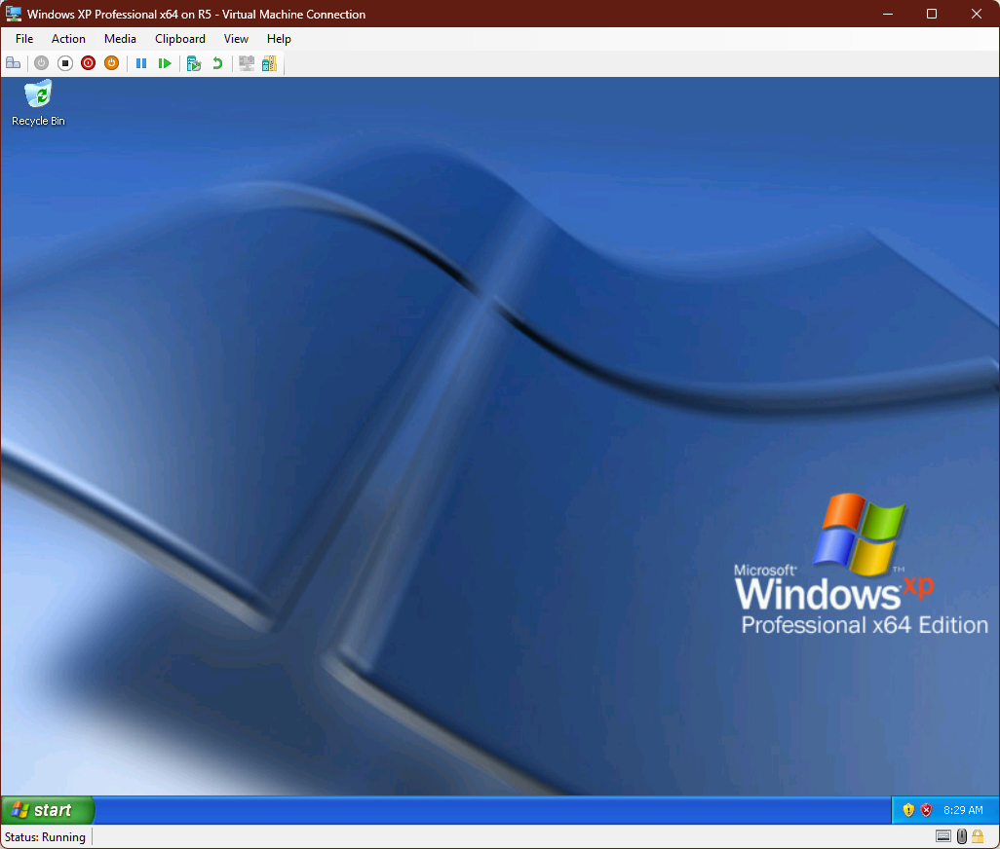

# Windows XP Professional (Hyper-V/AMD64)



## 1. Personal History

"Yes, but what are the minimum requirements?" That was me for most of the summer of 1991, toting around my IBM PC Convertible laptop - an 8088 in an 80286/80386 world. It never discouraged me as most software I wanted to run - the 1986 laptop from IBM just barely met the requirements for most things. I dreamed of the day I could load games from a high-density 1.44MB floppy disk, or run programs from a hard drive and see them in dazzling VGA - but that would not happen until later in life. For the moment, I continually revisited how close I could get to running Windows 3.0 on the Convertible - and the answer was always “close, really close.” The lack of a hard disk was the show-stopper, and even with one, point-and-click would have taken a back seat.

Windows 3.0 was the hottest operating environment on the market, and I wanted in. I was ready to run it with nothing but keyboard shortcuts. The fabled 386 Enhanced Mode was out of reach, so I settled for real mode. It didn’t matter. Windows 3.0 felt evolutionary - a glimpse of the future we take for granted in 2025 - even if I had to do it all without a mouse.

Getting Windows XP Professional x64 Edition running in Hyper-V brings me back to those days... as we will see below.

## 2.  Installing in Hyper-V

Installation was done on a Windows 11 Pro host, using a Gen 1 Hyper-V VM. Since Windows XP Professional x64 Edition does not support UEFI, Gen 1 with BIOS support is the way to go. I left everything else stock, keeping the disk controller on IDE, aside from enabling Dynamic Memory which lets it scale as low as 256MB and as high as 6144MB.

Once installation is complete, the road to mouse support begins - starting with Service Pack 2, which is required before Hyper-V Integration Services can be installed.

Mount the x64 Service Pack 2 ISO (w2k3sp2_3959_usa_x64fre_spcd.iso). Use keyboard shortcuts to launch explorer.exe, navigate to the CD/DVD drive, and run the installer (WINDOWSSERVER2003.WINDOWSXP-KB914961-SP2-X64-ENU.exe). A couple of Next clicks later, the installation runs, completes, and requests a reboot. Easy peasy.

Now for the Hyper-V Integration Services. The last known compatible release for Windows XP was 6.3.9300.16384, available on Archive.org at https://archive.org/details/Hyper-V_vmguest. Just like Service Pack 2, mount the ISO. Once mounted, the installer autostarts and completes on its own, giving you mouse control before the reboot prompt. When asked to restart, click Yes, and Hyper-V Integration Services is ready to go. In addition to the mouse working, you also get snappier graphics because the Integration Services replace Hyper-V’s generic emulated VGA driver with synthetic video drivers. You also gain resolution changes and full reporting back to Hyper-V Manager — including memory usage and network information.

## 3.  Updates
Windows Updates, as per usual, in 2025 are provided through Legacy Update at https://legacyupdate.net

## Bonus Section: Hyper-V Guest Versions (with Build Info)

A supplemental reference showing Hyper-V host releases, their Integration Services versions (with known build numbers), and notable guest OS support.

- **Windows Server 2008** (Hyper-V v1, 2008)  
  - Integration Services 6.0 series  
    - Builds:  
      - 6.0.6001.17101 (RTM)  
      - 6.0.6001.18016 (after KB950050)  
      - 6.0.6001.22258 (after KB956710)  
      - 6.0.6001.22352 (after KB959962)  
      - 6.0.6002.18005 (SP2)  
      - 6.0.6002.22233 (RTM + KB975925)
  - Guest support: Windows Server 2003 SP2, Vista SP1/SP2, Windows XP SP3  

- **Windows Server 2008 R2** (Hyper-V v2, 2009)  
  - Integration Services 6.1 series  
    - Builds:  
      - 6.1.7600.16385 (RTM)  
      - 6.1.7600.20542 (after KB975354)  
      - 6.1.7600.20683 (after KB981836)  
      - 6.1.7600.20778 (after KB2223005)  
      - 6.1.7601.17514 (SP1 RTM)
  - Guest support: Windows 7, Server 2008 R2, continued XP/Vista support  

- **Windows Server 2012** (Hyper-V v3, 2012)  
  - Integration Services 6.2 series  
    - Builds:  
      - 6.2.9200.16384 (RTM)  
      - 6.2.9200.16433 (after KB2770917)  
      - 6.2.9200.20655 (after KB2823956)  
      - 6.2.9200.21885 (June 2016 rollup, KB3161609)
  - Guest support: Windows 8, Server 2012  

- **Windows Server 2012 R2** (Hyper-V v4, 2013)  
  - Integration Services 6.3 series  
    - Builds:  
      - 6.3.9600.16384 (RTM)  
      - Incrementals via KB: 17415, 17831, 18080, 18339, 18398, 18692 (through mid-2017)
    - Notably, community reports confirm “.18398” as the July rollup build 
  - Guest support: Windows 8.1, Server 2012 R2 — last branch providing support for Windows XP and Server 2003  

- **Windows Server 2016** (Hyper-V v5, 2016)  
  - Integration Services reports as 10.0.x series—delivered via Windows Update, no standalone ISO needed
  - User reports show guest VMs showing version 10.0.14393.x, matching Windows 10/Server 2016 builds
  - Guest support: Windows 10 (initial releases), Server 2016  

- **Windows Server 2019 & 2022** (Hyper-V v6/v7)  
  - Still using Integration Services 10.0.x, aligned with client OS releases, delivered via Windows Update  
  - Support continues for modern Windows 10/11 builds and supported Linux distributions

---

### Usage Note  
If you wish to check the **exact Integration Services version** on a guest VM, in PowerShell run:

```powershell
Get-VM | ft Name, IntegrationServicesVersion

