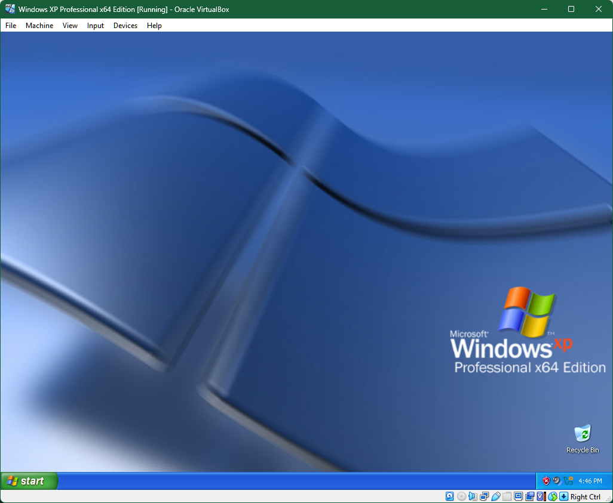

# Windows XP Pro x64



## 1. Personal History

My relationship with Windows during this period felt a bit like drifting away from a favorite band - not falling out of love, just wanting to explore other genres.

A decade earlier, I was fully immersed with the release of Windows 95, the Pentium processor, and just about everything swirling around the time period… like three button suits.

I was so far removed from the world of Windows at this time that when my grandmother had trouble visiting a website she regularly visited on her new Dell laptop, it was Dell support - not me - that explained she had been using the 64-bit version of Internet Explorer and needed to switch to the 32-bit version to get the site working.

I didn’t spend much time with the x64 variant until 2023, when I started exploring Virtual PC 2007. While Windows XP would go on to be the cornerstone of many of my emulation and virtualization projects, I had missed out on the vibe it carried during its hay-day. Nevertheless, I enjoy going back to it now to see what I missed - and in many ways, it acts as a conduit to my memories of late 2005 and early 2006.


## 2. Technical Changelog with 2005 User Perspective

### Windows Server 2003 Kernel (NT 5.2)

Windows XP x64 wasn’t just a bigger version of XP. It was built on the Windows Server 2003 kernel—NT 5.2—not the older NT 5.1 kernel from the original 32-bit XP. This meant you were standing on server-grade foundations, whether you realized it or not. While 32-bit XP was designed to feel like a consumer OS, XP x64 carried all the behind-the-scenes improvements from Microsoft’s enterprise server platform. Stability, memory handling, and security were all tighter right out of the box. Even if you never touched a server, you were now running the same core that powered them.

### Expanded Memory Support

One of the headline features was RAM support. 32-bit XP could address up to 4 GB of memory, but most systems could only actually use about 3.5 GB due to hardware limitations. XP x64 blew past that ceiling, supporting up to 128 GB of RAM. For most users in 2005, that number sounded ridiculous—but for anyone doing video editing, 3D modeling, virtualization, or handling massive datasets, it changed the game. You could build a workstation that felt like it had no limits. XP x64 was where your hardware finally started to breathe.

### Processor and Thread Scaling

XP x64 also lifted processor limits. The 32-bit version supported up to 32 logical processors, which was already more than enough for most people. But XP x64 doubled that to 64. Around 2005, multi-core CPUs like the AMD Athlon 64 X2 and Intel Pentium D were hitting the market. XP x64 could see every thread, every core, and scale with the hardware you were just starting to buy. If you were on the cutting edge, this was the OS that could actually keep up.

### Volume Shadow Copy Service (VSS)

Borrowed from Windows Server 2003, Volume Shadow Copy Service allowed XP x64 to take live snapshots of files—even while they were open and in use. This wasn’t something you’d see as a casual user, but if you used backup software that supported VSS, it meant you could back up your work without closing your applications. It brought server-grade data protection to your desktop, something 32-bit XP just didn’t have.

### Upgraded Web Server - IIS 6.0

If you did any kind of web development or hosted local web apps, XP x64 upgraded you from IIS 5.1 to IIS 6.0. This was the same version shipping on Windows Server 2003, not a stripped-down consumer edition. It was faster, more secure, and more standards-compliant. For developers, this made XP x64 a serious platform for local testing and even small-scale hosting.

### Media Player 10 Built-In

XP x64 shipped with Windows Media Player 10, offering the latest media playback features, including updated DRM support for purchased digital media. While not a headline feature for power users, it meant XP x64 came with Microsoft's latest media stack by default, keeping you in step with the digital media landscape of the mid-2000s.

### Remote Desktop Enhancements

XP x64 brought improvements to Remote Desktop, including Unicode keyboard support, client-side time-zone redirection, and better rendering performance. For IT professionals or anyone working remotely, these changes made managing multiple machines or working across different locations smoother and more reliable.

### WOW64 Subsystem for 32-bit Applications

One of the biggest compatibility questions in 2005 was whether your existing software would run. XP x64 included the WOW64 (Windows-on-Windows 64-bit) subsystem, allowing most 32-bit applications to run without issue. However, it dropped support for 16-bit applications entirely. That meant older DOS and Windows 3.x programs were no longer supported, cutting off a long tail of legacy software. For most users, this wasn’t a big deal—but for specialized business tools or retro gamers, it mattered.

### Mandatory 64-bit Driver Support

XP x64 required native 64-bit drivers. 32-bit drivers were not compatible. This was one of the biggest hurdles for users in 2005. Hardware vendors were slow to release 64-bit drivers for many consumer devices like printers, webcams, and sound cards. If your device didn’t have a 64-bit driver, it simply wouldn’t work. For enthusiasts and early adopters, this meant double-checking hardware compatibility before making the jump.

### Program Files Directory Split

To manage compatibility with both 32-bit and 64-bit applications, XP x64 introduced two separate Program Files directories:
- Program Files for native 64-bit apps.
- Program Files (x86) for 32-bit apps running under WOW64.

This structure would go on to become standard in later versions of Windows, but XP x64 was where it started.

### Kernel Patch Protection (PatchGuard)

XP x64 introduced Kernel Patch Protection, also known as PatchGuard. This feature blocked third-party software and malware from making unauthorized modifications to the Windows kernel. While this improved security, it also broke compatibility with some low-level tools like antivirus or virtualization software that depended on hooking into the kernel. It was Microsoft drawing a line in the sand to protect the OS at its core.

### IPSec Networking Improvements

Inherited from Windows Server 2003, XP x64 brought advanced IPSec (Internet Protocol Security) features to the desktop. This made setting up secure VPNs, encrypted communications, and network policies more reliable and robust, borrowing directly from enterprise-grade networking features.

### Different Service Pack Timeline

Because XP x64 was based on Windows Server 2003, it followed the server’s update and service pack schedule, not the consumer XP schedule. This meant:
- It launched with many of the features that 32-bit XP wouldn’t get until Service Pack 2.
- It received its final update as Service Pack 2, ending support earlier than 32-bit XP, which received a Service Pack 3.

This often confused users who expected XP x64 to follow the same update path as their 32-bit installations.

#### Service Pack Changelog

##### Service Pack 1 (SP1)

- **Release Date**: April 25, 2005
- **Build Number**: 5.2.3790.1830
- **Overview**: The RTM version of Windows XP Professional x64 Edition was built from the Windows Server 2003 Service Pack 1 codebase. As such, it included many features that were introduced in the 32-bit XP Service Pack 2, such as:
  - Enhanced security features, including Data Execution Prevention (DEP)
  - Windows Firewall enabled by default
  - Improved Bluetooth support
  - Introduction of Security Center
  - Support for Wi-Fi Protected Access (WPA)
- **Note**: Since XP x64 was based on the Server 2003 SP1 codebase, it did not receive a separate SP1; the RTM release effectively served as SP1.

##### Service Pack 2 (SP2)

- **Release Date**: March 13, 2007
- **Build Number**: 5.2.3790.3959
- **Overview**: SP2 was the first and only service pack released specifically for Windows XP Professional x64 Edition. It included:
  - All previously released updates for the operating system
  - Enhanced security and stability improvements
  - Updates to existing Windows Server 2003 features and utilities
- **Note**: SP2 for XP x64 is not the same as SP2 for 32-bit versions of Windows XP. Due to the different codebases, the service packs were developed separately.

## 3. VirtualBox VM Setup

At risk of repeating myself, setting up Windows XP Professional x64 Edition is a fairly straightforward affair. We had been living comfortably during this era with bootable CD images, making it easy to get started once your virtual machine is configured.

My configuration uses:

- Two CPUs  
- 1 GB of RAM  
- 20 GB hard drive image, with Host I/O Cache enabled  
- 128 MB of video memory  

Everything else is left at its defaults. Now let’s boot up.

**Initial boot and setup screen**  
We’re greeted by a familiar sight, one that makes me smile every time - going back to the DOS 5.0 and Windows 3.x era - the blue background with white text installation screen, carried forward through Windows NT 3.x, NT 4.0, 2000, and XP.

**Partitioning the disk**  
Pressing Enter to continue, followed by F8 to agree to the license terms, we’re brought to the disk partitioning screen. This was one of the more convenient parts of Windows XP setup. You could simply press Enter to install, and the setup process would create a primary partition using the full disk size. It also gave you options: NTFS or FAT, with standard and quick format modes.

As we’re in Windows NT territory, NTFS is the right choice. And since time is the currency of our lives, "Format the partition using the NTFS file system (Quick)" is the most efficient path forward.

**File copy phase**  
Good ole drive C: is formatted and the file copy process begins. This part of setup was always reassuring - especially back in the NT days - because if the copy succeeded, you knew your CD-ROM drive had been properly detected and you were past stage 1 of the install.

In the Windows NT 3.x and 4.x era, this file copy phase wasn’t just about moving files - it was a literal handoff. The text-mode setup looked like DOS, but it wasn’t. It was a custom real-mode environment loaded by NTLDR, using embedded drivers and configuration files like `TXTSETUP.SIF` to access your storage devices. This phase existed solely to partition the disk, format it, and stage the installation files. Once complete, the system rebooted into protected mode and transferred control to the NT kernel. If something was going to fail, it almost always happened before that transition. Getting past this step meant you were likely in the clear.

**Graphical setup and user entry**  
Once files are copied, setup reboots and we move into the graphical portion. This is where the tradition of clicking Next begins - familiar and unchanged since Windows 3.x. You enter your name, product key, and computer name.

**Administrator account behavior**  
Here we encounter one of the differences introduced by the x64 version. Unlike the 32-bit edition, which created a new user account during setup, Windows XP Professional x64 prompts you to assign a password to the Administrator account. This behavior comes from its Server 2003 base. There’s no default user account created for you - you log in as Administrator unless you manually add other accounts after installation.

**Time and date**  
Continuing, you’re asked to set the date, time, and time zone. Always a pleasant moment when your VM clock syncs up - another subtle sign that things are working as they should.

**Network configuration**  
Now we arrive at Networking Settings. Typical Settings does the job even today: you get TCP/IP with DHCP and the usual SMB-based file and printer sharing. But if you select Custom Settings, choose Install, then Protocol, you’ll find that IPv6 is available. It works, but it lacks DHCPv6 support. You’ll need to manually assign an address if you want to experiment with IPv6 on this platform.

**Workgroup vs. domain**  
After network setup, you’re asked whether this machine is part of a domain or a workgroup. Workgroup is the correct term here - going back to Windows for Workgroups 3.1 and Windows NT 3.1 Workstation. Realm, while technically meaningful in other contexts, is not used here.

**Final steps and login**  
Setup continues with file registration, component installation, and the usual background tasks. Then we’re brought to the login screen - not into your new account, but to the classic Administrator prompt. Again, this matches the Server 2003 behavior. The system expects that you’ll take control from there, not be handheld through a guided experience.

Once you enter the password, you’re greeted by the Windows XP chime and your desktop.

## 4. Guest Additions, and Activation

### Guest Additions

Under VirtualBox 7, installing the Guest Additions - for the video driver in particular, but not exclusively - is as easy as clicking Devices, then Insert Guest Additions CD Image. Open the CD-ROM in File Explorer, let it AutoRun, and click through the prompts. A few Next clicks, a reboot, and you're done.

With Windows XP, you’ll receive a security alert during installation that the drivers have not been tested by Microsoft’s Windows Hardware Quality Labs. Clicking Yes allows the installation to continue. You’ll then get four additional pop-ups, each warning that VirtualBox’s drivers have not passed Windows Logo testing. Clicking Continue Anyway each time lets the install proceed, and once complete, you’ll be asked if you want to reboot.

### Activation

This brings us to activation, which - by 2025 - is no longer possible over the Internet. As my CD key is valid, I use the phone activation method, which still works as of 2025.

Starting the Activate Windows process, I select the second option - Yes, I want to telephone a customer service representative to activate Windows. This generates an Installation ID and presents four steps on screen:

- Choose your location  
- Call the number shown  
- Follow the voice prompts and provide your Installation ID  
- Receive the Confirmation ID  

If the activation is successful, you’ll be given the option to hear the Confirmation ID or, in a new development that shows Microsoft is still working on their phone activation system, have it sent via SMS. Once entered into the Activation window, Windows XP Professional x64 Edition is activated.

## 5. Windows Updates

At the end of the day - or the end of an install - your operating system’s main job is to run applications for you. With the VirtualBox setup complete and Windows activated, we could stop here. But no - let’s go further and bring Windows XP x64 up to date.

In 2025, there are still two available pathways to update Windows XP - both 32-bit and 64-bit - and we’ll explore both. Let’s start with the easy one.

### Legacy Update

Legacy Update (www.legacyupdate.net) is simply amazing. It gives folks like me an easy path to update nearly every version of Windows going back to 2000. Anything I could write here won’t do it justice - go there and have a great time.

### WSUS

Despite loving Legacy Update - and it being my preferred method - I still keep a WSUS (Windows Server Update Services) server in cold storage with everything from Windows 2000 through the Vista era, plus some applications.

The advantage of running your own WSUS server is having a local copy of all the updates you want, ready when you need them. The downside is that keeping what is essentially an update database server on standby takes disk space - and over time, it will demand more memory to keep that database responsive as it grows.

To get Windows XP Pro x64 working with WSUS, you’ll need two things:

1. `windowsupdateagent-7.6-x64.exe`
2. A registry update to point the system at your WSUS server. For example:

```
Windows Registry Editor Version 5.00

[HKEY_LOCAL_MACHINE\SOFTWARE\Policies\Microsoft\Windows\WindowsUpdate]
"WUServer"="http://10.0.7.65:8530"
"WUStatusServer"="http://10.0.7.65:8530"

[HKEY_LOCAL_MACHINE\SOFTWARE\Policies\Microsoft\Windows\WindowsUpdate\AU]
"UseWUServer"=dword:00000001
```

After that, make sure your Windows XP update settings are set to Notify but don’t download automatically. Then open CMD.exe and run:

```
wuauclt /reportnow
wuauclt /detectnow
```

Give it a few moments, and the update notifier should let you know there are new updates available.

## Bonus: Remote Desktop Anti-Aliasing Fix

A lot of my virtual adventures were done while I was physically away from my main system, and in the early days I relied mostly on Windows' Remote Desktop. When I started working with XP, something seemed off... and I found that anti-aliasing is not enabled in Remote Desktop by default.

A quick registry change will enable it and improve your remote viewing experience:

```
Windows Registry Editor Version 5.00

[HKEY_LOCAL_MACHINE\SYSTEM\CurrentControlSet\Control\Terminal Server\WinStations]
"AllowFontAntiAlias"=dword:00000001
```

After applying this change, fonts in your Remote Desktop session will render with proper smoothing, making everything from menus to code much easier on the eyes.

