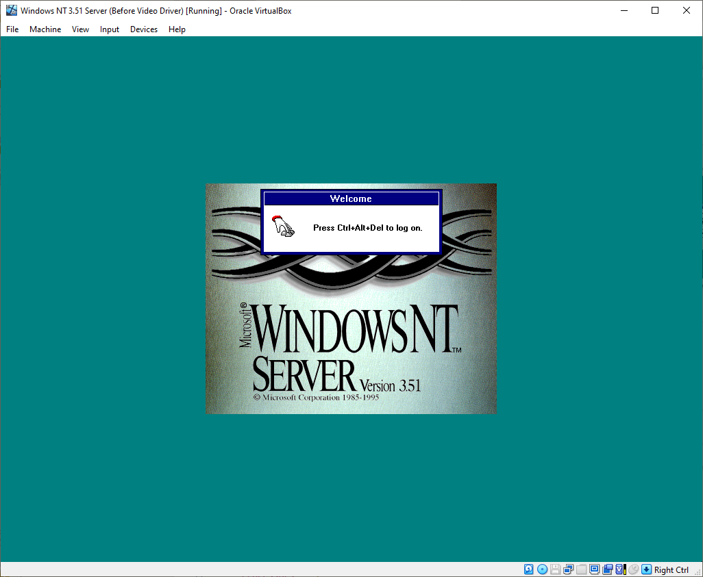

# Windows NT 3.51 Server (VirtualBox/i386)




## 1. The Value of NT 3.51 Server
- By 1996, NT 3.51 Server was already several years old, with NT 4.0 and Windows 95 gaining popularity for their modern, user-friendly interfaces. At that time, NT 3.51's Windows 3.1-like appearance felt outdated. However, NT 3.51 Server has proven itself resilient and highly compatible.
- NT 3.51 Server has become a crucial foundation in my virtualization projects due to its wide compatibility across DOS, Windows, Macintosh, and OS/2 environments. This versatility makes it an excellent platform for tasks spanning multiple legacy systems.

## 2. Changes from Windows NT 3.1 Advanced Server to Windows NT 3.51 Server

### 3.1 to 3.5 Transition (Released September 1994)
- **Performance Improvements**: NT 3.5, codenamed "Daytona," introduced significant performance gains, particularly in memory usage and speed.
- **Networking Enhancements**: NT 3.5 offered integrated TCP/IP and WINSOCK support, re-engineered TCP/IP and IPX/SPX stacks, NetBIOS over TCP/IP (NetBT), and improved RAS, adding PPP support.
- **File Systems**: Introduced support for VFAT, allowing long filenames on FAT systems, alongside other I/O improvements.
- **Graphical Updates**: The UI was refined to align more closely with Windows for Workgroups 3.11, making it more familiar.

### 3.5 to 3.51 Transition (Released May 1995)
- **Windows 95 Compatibility**: NT 3.51 included updates for client/server compatibility with Windows 95.
- **New Features**: Added support for NTFS file compression, persistent IP routing, and improved OpenGL support.
- **PCMCIA Support**: Windows NT 3.51 introduced support for PCMCIA cards, allowing users to utilize various peripheral devices, such as network adapters and storage devices, through the PCMCIA interface. However, hotplugging (the ability to insert or remove PCMCIA cards while the system is running) is not supported in Windows NT 3.51 Server.
  - **Why Hotplugging Is Not Available**:
    - Windows NT 3.51 lacks the necessary drivers and kernel-level support for hotplugging, meaning that the operating system is unable to detect and configure the devices automatically when inserted or removed while the system is running. This limitation is largely due to the way Windows NT 3.51 handles hardware initialization, which requires devices to be present during boot to be correctly configured.
    - Users are required to shut down the system before adding or removing PCMCIA cards to ensure proper detection and configuration of the hardware.
- **Stability and Size**: Optimized for improved stability and a reduction in system footprint.

## 3. VirtualBox VM Setup

### New VirtualBox VM Setup
- **Type**: Microsoft Windows
- **Version**: Windows NT 3.x

### Hardware Settings
- **RAM**: 128 MB
- **Processors**: 2  
  - **Recommendation**: Install with 2 CPUs from the start to avoid performance issues when upgrading later.
    - **Note**: Windows NT 3.51 Server supports multi-processor configurations, but if you install it with a single CPU and later "upgrade" to multi-processor support, you may experience performance issues. This happens because the kernel, device drivers, and system configuration are optimized for single-core setups during the initial installation. When switching to a multi-processor system afterward, Windows NT 3.51 Server might not fully utilize the second CPU, resulting in suboptimal performance or instability.
    - **Why This Happens**: Multi-processor support requires special kernel handling, and changing the CPU configuration after installation may lead to incomplete or incorrect kernel resource allocation. Additionally, some system components, such as the **HAL** (Hardware Abstraction Layer), may not be configured properly to handle the second processor if the system wasn't initially set up with multi-core support.
    - **Citation**: "The HAL (Hardware Abstraction Layer) and kernel behavior in Windows NT is optimized for the initial system configuration. Upgrading from a single-core installation to multi-core may not allow the OS to fully utilize the second CPU effectively, causing performance issues." [Source: "Windows NT Performance Guide", Microsoft Documentation, 1995]

- **Size**: 1 GB

- **Additional Changes**:
  - **Disable Audio**
  - **Network Adapter**: Attach to Bridged Adapter for network access. This allows the virtual machine to connect to your physical network.
  - **Microsoft Network Adapter Multiplexor or Driver**: Useful for bridging connections to TAP interfaces or your VMware Network Adapter VMnet 8.

### CD-ROM Drive Configuration (Optional)
- **Remove the Existing CD-ROM Drive**: Go to the VirtualBox settings for the VM, and in the "Storage" tab, remove the existing CD-ROM drive (if any).
- **Add IDE CD-ROM Drive**: In the "Storage" tab, click on "Add IDE Controller." Under the IDE Controller, click "Add CD/DVD Device" and select your ISO or CD-ROM drive. This setup allows easier access to CD-ROM drives in DOS environments and early NT versions by using drivers like `oakcdrom.sys` for seamless integration.

## 4. Preparing the Disk with DOS Boot Disk
To set up Windows NT 3.51 Server, we will use an MS-DOS 5.0 boot disk. This disk includes essential utilities for partitioning and formatting the virtual hard disk with the FAT file system, which will later be converted to NTFS by the Windows NT 3.51 Server installer.

### Steps:
1. **Boot from the MS-DOS 5.0 Boot Disk**:
   - Start your VirtualBox VM, selecting the MS-DOS 5.0 boot disk as the startup disk.
   - You’ll see a DOS prompt: `A:\>`, where you can type commands to prepare the virtual disk.

2. **Partition the Virtual Disk Using fdisk**:
   - Type `fdisk` and press Enter to open the DOS partitioning tool.
   - Choose option 1 to create a new Primary DOS Partition. Allocate the maximum available space.
   - Restart the VM after creating the primary partition.

3. **Format the Partition with the FAT File System**:
   - After rebooting, return to the DOS prompt.
   - Type `format C:` and press Enter. Confirm the format if prompted.

## 5. Windows NT 3.51 Server CD-ROM Structure and Installation Methods
### Exploring the CD-ROM Structure
The Windows NT 3.51 Server CD-ROM is organized into folders, each containing installation files for different CPU architectures, showcasing NT’s cross-platform flexibility:
- **i386**: For Intel x86 architecture, which we’re using in VirtualBox.
- **Alpha**: For the Alpha CPU, known for high performance.
- **PPC (PowerPC)**: For PowerPC architecture, used in Apple Power Macs.
- **MIPS**: For MIPS architecture, optimized for specific tasks.

For our setup, we’ll use only the `i386` folder.

### Installation Methods
Switch to the `i386` directory:
```bash
CD i386
#### Option 1: `winnt /ox` to Create Boot Disks
Running `winnt /ox` will create three boot disks, useful for systems that can't boot directly from the CD-ROM. You’ll need three formatted 3.5-inch floppy images for this method.

#### Option 2: `winnt /b` for a Floppyless Installation
The `winnt /b` command skips the need for boot disks entirely. This makes setup faster and is ideal for virtual environments, where floppy disks aren’t necessary.

## 6) Windows NT 3.51 Server Setup

Now that you've used either the `winnt /ox` method to create boot disks or the `winnt /b` method for a floppyless installation, you'll be greeted by the **Windows NT Server setup screen**.

> **Note:** Although we configured two processors, NT displays "1 processor multiprocessor kernel" at first boot. This message appears because NT 3.51 was optimized for single-processor setups and must detect additional processors after the initial kernel load. We’ll proceed with this configuration for improved compatibility.

### Setup Instructions

1. **Press Enter**
2. **Custom Setup**: Press `C` for Custom Setup. This option allows for detailed hardware configuration, ideal for virtualization.
3. **SCSI/IDE Controller Detection**: NT will detect our SCSI or IDE controllers. Press Enter to continue.
4. **Hardware Confirmation**: Confirm your hardware components. In VirtualBox, defaults are sufficient, so press Enter.
5. **Partition Selection**:
   - **Partition and Format**: We already partitioned and formatted the disk using the MS-DOS boot disk, which allowed us to use the `winnt /b` method. Select the `C: [FAT]` partition and press Enter to install.
   - **Convert to NTFS**: On the next screen, choose to convert the partition to NTFS and press `C` to confirm.
     > **Why NTFS?** NTFS provides better security, file compression, and support for larger files and disks. It’s ideal for server environments, unlike FAT, which lacks these features. NTFS is better suited for file integrity and access control.

6. **Installation Directory**: Leave the installation directory name as is and press Enter.
7. **Disk Check**: The system will perform a disk check for corruption. Press Enter to proceed.
8. **Restart**: After setup completes, press Enter again to restart the computer.

### Initial Setup Configuration

1. **Welcome Screen**: NT will boot up and prompt you to enter a name and company. Enter as desired.
2. **Security Role**: Select **Server** in the "Windows NT Server Security Role" screen. 
   - We’re setting up a standalone server, not a domain server, so we won’t configure a Primary Domain Controller (PDC) or Backup Domain Controller (BDC).
   - > **More Info on Domain Styles**: [Add more details here later].
3. **Licensing**: Enter your licensing information based on your own setup. 
4. **Computer Name**: For this setup, enter `WINNT351S` as the computer name, then confirm.
5. **Locale**: Confirm the United States locale (adjust if needed).

### Network Configuration

1. **Windows Components Selection**: Deselect **Setup Printers** (optional).
2. **Windows Optional Components**: Keep everything checked for now.
3. **Network Adapter Card Detection**: Click **Continue** to detect the network adapter card.
   - The **AMD PCNet Family Adapter** will be found automatically. Continue with the default settings.
   - Leave the **Card Options** (Full Duplex and Bus Timer) as is.
4. **Network Protocols**:
   - Keep **TCP/IP Transport** selected. This protocol supports modern networking standards.
   - Optionally, enable **NetBEUI** for a configureless setup, useful for users without TCP/IP experience.
     > **Why NetBEUI?** NetBEUI requires no configuration and is simpler than TCP/IP but has limited routing capabilities and is not as scalable, making it unsuitable for larger networks.

5. **TCP/IP Settings**:
   - In **TCP/IP Installation Options**, check **Enable Automatic DHCP Configuration** unless you need a static IP.
   - For this virtual setup, DHCP is sufficient, but you may opt for a static IP if needed.

### Continuing Setup

After confirming the **TCP/IP Installation Options**, setup will continue with a series of splash screens.

1. **Network Settings**: 
   - You’ll be brought to **Network Settings**, where you can add additional network protocols, adapters, and drivers. This section allows NT to interface with different types of networks, providing connectivity through selected protocols. However, for most VirtualBox setups, no modifications are needed, so you can click **OK** to proceed.

2. **Automatic Network Configuration**:
   - The network will now be configured, and the **TCP/IP server** will start. Windows NT operates with a modular architecture where many system services, like networking, run as individual servers. This design helps NT to manage resources more efficiently and allows each service to run independently, improving stability.

3. **Domain/Workgroup**:
   - In the **Domain/Workgroup** setup, select **WORKGROUP** as your default workgroup. WORKGROUP remains a common networking standard across Windows versions for simplifying local networking and file sharing.

4. **Program Group Creation**:
   - Setup will create graphical program groups for easy access to applications and system tools, after which you’ll reach the **Administrator Account Setup**.

5. **Administrator Account Setup**:
   - Choose a password for the **Administrator account**. Note that NT 3.51 stores passwords using older encryption methods, making them potentially vulnerable to password-cracking tools. Be cautious about password strength, but also be aware of these limitations.

6. **Local Account Setup**:
   - Create a local user account. Having both an Administrator and a standard local account is a common security practice, allowing general use without elevated privileges. Choose a password with caution, remembering that NT 3.51’s encryption can be easily cracked by modern standards.

7. **Virtual Memory**:
   - Leave the **Virtual Memory** settings at the default for now. Virtual memory, managed through a "pagefile," acts as an extension of physical RAM on the disk, allowing the system to handle more tasks by moving data in and out of RAM as needed. Adjusting the pagefile size is beneficial for systems with limited memory but is less critical in virtual environments.

8. **Application Search**:
   - Setup will now search the hard drive for any existing applications to add to **Program Manager**. Clicking **Search Now** should reveal the MS-DOS Editor, which you can choose to add. Select applications using the arrow keys and click **Continue**.

9. **Date/Time Setup**:
   - Set your time zone and click **OK**.

10. **Display Settings**:
   - You’ll reach the **Display Settings** screen. Accept the default VGA-compatible display adapter settings. We’ll upgrade the graphics driver later to support higher color depths and resolutions.

11. **Emergency Repair Disk**:
   - Windows NT 3.51 will prompt you to create an **Emergency Repair Disk** (ERD). ERDs store critical system information, allowing recovery if the system becomes unbootable. However, since I use snapshots to preserve the machine’s state, I’ll skip this step. If you choose to create one, use a blank 3.5-inch floppy image, not one of the setup disks created with `winnt /ox`.

12. **Final Restart**:
   - Windows NT 3.51 installation is complete. Click **Restart Computer**. During the reboot, Windows NT will convert your partition from FAT to NTFS if you selected that option. After one more restart, you’ll reach the **Windows NT 3.51 Server** login screen.

Your Windows NT 3.51 Server setup is now complete!
## Additional Note: Processor Count Display in Windows NT 3.51 Server

If you’re running Windows NT 3.51 Server on a dual-processor system, you may notice that the boot screen displays "1 system processor" even when two processors are installed. This is due to the design of the NT 3.51 multiprocessor (MP) kernel, which initially loads as if there is only one processor. NT does this to simplify compatibility and to conserve resources at startup. While NT 3.51 fully supports dual processing, it may only report "1 processor" during boot as the system kernel manages full multiprocessor support after the initial startup phase. Later versions of Windows NT, like NT 4.0 and Windows 2000, provide improved multiprocessor handling and more accurate reporting during startup.

## **Optional: Adding a Video Graphics Driver to Windows NT 3.51 Server in VirtualBox**

Adding a graphics driver can increase the available color depth and resolution options, enhancing the visual experience of Windows NT 3.51. Follow these steps:

1. **Download the Drivers**  
   - Download the video graphics drivers from https://archive.org/details/VBEMPNT. This ISO contains drivers for various Windows versions and chipsets.
   - Note: Since the drivers are packaged in an ISO file, there’s no need to decompress or transfer files to a floppy disk image.

2. **Navigate to the Necessary Folders**  
   - Within the ISO, locate the drivers we need in the following directories:
     - `VIRTUA~0\VIDEOM~2` (as viewed in Windows NT 3.51’s File Manager, which lacks long filename support).
     - `FRAMEBUF\100705\NT35X` for the file `FRAMEBUF.DLL`.
   - **Note**: NT 3.51’s File Manager does not support filenames longer than 8 characters, so long names appear shortened (e.g., `VIDEOM~2`).

3. **Copy Driver Files**  
   - Using Windows NT's File Manager program, for simplicity, create a folder on the C: drive called `Drivers`, with a subfolder `Video`.
   - Copy all files from `VIDEOM~2` and `FRAMEBUF\100705\NT35X` into `C:\Drivers\Video` (all files in one folder, no subdirectories).

4. **Install the Graphics Driver**  
   - Open **Program Manager** > **Main** > **Control Panel** > **Display**.
   - In **Display Properties**, select **Change Display Type** > **Change** under the Display Adapter section.
   - In the list, select **Other** to manually load a new graphics driver.

5. **Specify the Path and Install**  
   - Enter `C:\Drivers\Video` in the search dialog box.
   - Choose a device, such as **VirtualBox 800x600, True Color** or **1024x768, True Color** from the list and click **Install**.
   - Confirm any prompts, including the system configuration change and path verification.

6. **Reboot to Apply Changes**  
   - You’ll be prompted to reboot after installation. Reboot to activate the new graphics driver.

After rebooting, Windows NT 3.51 Server will have a proper graphics driver installed, allowing for better color depth and higher resolutions.

## **Extras**

### Windows NT 3.51 Server Resource Kit

The **Windows NT 3.51 Server Resource Kit** is a toolkit Microsoft designed to extend the server’s capabilities with utilities that help manage, troubleshoot, and optimize your setup. Here’s a closer look at some of the essential command-line tools and utilities included:

- **NETMON**  
  - A network monitoring tool to view and analyze network traffic. NETMON helps you troubleshoot network issues by capturing packets and identifying potential bottlenecks or failures.

- **PERFMON**  
  - This is the performance monitoring utility that allows you to track CPU, memory, disk, and network activity. It’s essential for checking resource usage and finding areas where you might need optimization.

- **SC**  
  - The Service Controller (SC) is used to manage services on the server, allowing you to start, stop, and configure services directly from the command line.

- **SYSDIFF**  
  - A utility to compare system files and registry entries before and after installing software. It’s a handy tool for tracking changes and rolling back configurations when testing new software.

- **REG**  
  - This tool is for interacting with the registry from the command line. You can use it to add, delete, or query registry keys, making it easier to automate certain system configurations.

- **SHOWACL**  
  - This utility displays access control lists (ACLs) for files and directories. SHOWACL is useful for verifying permissions and ensuring your file security settings are configured properly.

- **DISKPERF**  
  - Enables or disables disk performance counters on NTFS volumes. It’s valuable for tracking disk I/O performance, which can be critical in a server environment.

- **DIRUSE**  
  - This tool shows directory usage, allowing you to check how much space each folder is using. It’s especially useful for managing storage and spotting large directories that might need cleanup.

- **UPTIME**  
  - Reports how long the system has been running without a restart. This is a straightforward tool but a valuable one for tracking server stability.

These tools make NT 3.51 much more manageable for system administrators and power users, providing control over system performance, security, and network settings.

---

### Windows for Workgroups 3.11 – A Classic Addition

Alongside Windows NT 3.51 Server, Microsoft included **Windows for Workgroups 3.11** on the installation CD. You’ll find it ready to access directly on the disc, offering a look at one of Microsoft’s earliest networked systems.

#### Why It’s Included *(Speculative)*

Windows for Workgroups 3.11 provided essential networking capabilities to DOS-based environments back in its time, making file sharing and network collaboration possible without a dedicated server OS. For those working with NT 3.51 today, it’s a chance to explore the origins of Windows networking and see firsthand how these early systems functioned.

To access it, browse the CD’s directory for the **\WIN311\INSTALL** folder and follow the setup instructions on a compatible system. It’s a useful addition if you’re interested in experimenting with or learning from older networked systems.